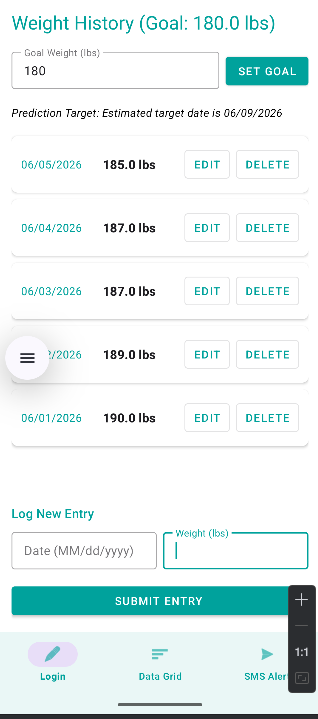
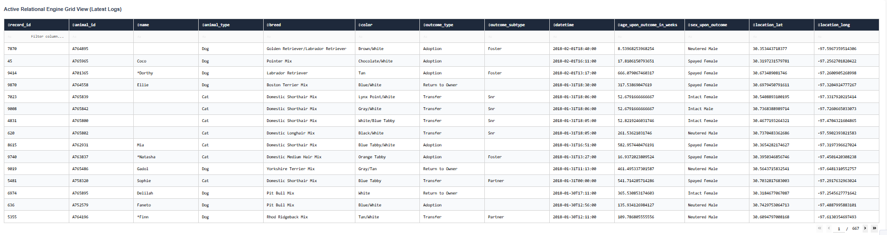

# Joshua Trabka

### Professional Self-Assessment
Completing the Computer Science Bachelor’s program has been an incredible growing experience, both academically and professionally. Over the course of the program, I have been able to refine the technical knowledge and skills essential to thrive in the computer science field. More importantly, I have gained a clearer understanding of my professional identity, core values, and career goals. This ePortfolio provides an opportunity to showcase what I have learned, highlight my technical competencies, and reflect on how my education has prepared me to contribute meaningfully in a professional setting.

Throughout my coursework, I engaged with a broad range of topics that collectively contributed to my development as a well-rounded software development and data professional. I have learned to approach complex engineering problems systematically and efficiently while addressing real-world challenges. The projects that I have completed have allowed me to think critically and design scalable solutions, which are vital skills in software development and systems design. Working through the full software development life cycle, from requirements gathering from stakeholders to production deployment, I have become highly comfortable with version control systems such as Git, collaborative development tools, and agile methodologies.
Equally important to technical proficiency is the ability to collaborate effectively in agile, team-based development environments and communicate across multi-tiered organizational landscapes. Throughout my coursework, I actively utilized Git version control and Agile methodologies to align team goals, conduct peer code reviews, and maintain continuous development pipelines. Furthermore, I mastered the critical skill of translating complex backend data structures into clear, accessible concepts tailored for both technical engineering teams and non-technical business stakeholders. Visually, I achieved this by converting raw relational tables into an interactive, user-facing Dash presentation layer featuring real-time KPI data cards and geospatial distributions, enabling non-technical managers to make data-driven decisions with zero technical friction.

Algorithmic principles form the cornerstone of scalable computing solutions, requiring a deep understanding of how data persistence choices impact memory consumption and execution latency. This competency is demonstrated in the weight-tracking mobile application I developed for my CS-360 course, where I engineered custom local data tracking structures and implemented linear regression algorithms to dynamically compute and predict forward-looking goal dates based on historical trends. I also consistently evaluate performance trade-offs, such as optimizing client-side web rendering when managing large datasets. By replacing restrictive data truncation caps with a front-end virtual pagination algorithm, my designs maintain full dataset searchability across thousands of background records while rendering a lightweight visual window, maximizing browser hardware efficiency.

Modern software engineering demands strict adherence to modular design principles like the Separation of Concerns and the Single Responsibility Principle across diverse database paradigms. While my foundational coursework in CS-340 relied on document-oriented MongoDB frameworks for flexible, rapid NoSQL schema prototyping, my capstone work showcases the advanced ability to execute comprehensive ETL pipelines that migrate legacy applications into optimized relational structures. Using Jupyter Notebook, I extracted unvalidated source files, mapped precise data definitions, and constructed an enterprise-aligned MySQL Relational Star Schema—isolating entity boundaries into distinct dimension tables (Dim_Animals, Dim_Outcomes) connected to a central transaction ledger (Fact_Shelter_Outcomes). This backend data layer communicates exclusively through an independent, object-oriented Python CRUD service class, ensuring that transactional query logic remains fully decoupled from the presentation interface.

A professional developer must maintain a proactive security mindset that anticipates adversarial exploits during the architectural phase rather than treating resource integrity as an afterthought. To defend relational database engines from dangerous SQL Injection exploits, I design all backend transactional systems to process inputs strictly through parameterized queries wrapped inside custom object-oriented CRUD modules. This setup treats user inputs exclusively as literal string values rather than executable database commands. Additionally, my designs consciously mitigate severe software flaws, such as the practice of hardcoding administrative credentials within exposed client-side source scripts. By isolating authentication logic within secure backend server environments and utilizing environment-variable injections, my software architectures maintain robust data privacy and strict access controls.

### Code Review
The following code review contains the artifacts shared in this portfolio. I go over each project separately discussing the existing functionality, any errors that will be corrected, and includes my plans to enhance each project to satisfy the course outcomes and demonstrate my skills.

  <iframe width="560" height="315" src="https://www.youtube.com/embed/0Z7vfncw_fM" title="YouTube video player" frameborder="0" allow="accelerometer; autoplay; clipboard-write; encrypted-media; gyroscope; picture-in-picture; web-share" referrerpolicy="strict-origin-when-cross-origin" allowfullscreen></iframe>

### Enhancement One: Software Design and Engineering

For the Software Engineering and Design Category of my portfolio, I chose to enhance the weight tracking app I created using Android Studio for my CS – 360 course. The selected artifact is a native Android mobile application designed to track user weight metrics over time and alert users via SMS text messages upon reaching milestones or targeted fitness goals. The core application logic is implemented in Java, utilizing an SQLite database for reliable data storage and management. The user interface is built using xml-based layouts styled with Material Components. The initial iteration of the application was developed in late 2025, with subsequent iterations and architectural refactoring completed in May 2026 to enhance security, user experience consistency, and data integrity.

This artifact is included in the ePortfolio because it represents a complete full-stack mobile development lifecycle, showcasing competencies in frontend UI/UX alignment, local database integration, and handling device hardware permissions. When submitting the project originally, I had not been able to set up a functional editing feature to allow users to make modifications to their weight entries. In the original version of the project, users would have needed to delete the entry then create a new entry, while functional this added increased steps for the user, and I wanted to fix this in my enhancement plan by writing logic to make edits, and by adding an edit button to the display to be consistent with the delete feature. 
  
In my enhancement plan proposal, the three course outcomes I intended to meet with the enhancement plan in this category were:
  
•	Design, develop, and deliver professional-quality oral, written, and visual communications that are coherent, technically sound, and appropriately adapted to specific audiences and contexts.

•	Demonstrate an ability to use well-founded and innovative techniques, skills, and tools in computing practices for the purpose of implementing computer solutions that deliver value and accomplish industry-specific goals.

•	Develop a security mindset that anticipates adversarial exploits in software architecture and designs to expose potential vulnerabilities, mitigate design flaws, and ensure privacy and enhanced security of data and resources.

I feel I have achieved each of these outcomes in the completion of my enhancement plan. By converting hard coded strings within my main activity into string resources, this aligns with Android’s native localization engine. By moving strings into a resource file, it allows Android OS to convert these resources into another language based on user language preferences, allowing the app to be adapted to diverse audiences. In programming the editing logic, I needed to use my skills in computing practices to implement a computer solution to deliver value to the end user. This feature makes the application easier to use for the end user. I also needed to use a security mindset for this feature to ensure that any input passed by the user is validated before being passed into the database.

While enhancing the application, I noticed that some parts of the application needed better commenting, as some parts of the application took me longer to understand after revisiting the project after about six months. I also noticed that I had many hard-coded strings within my MainActivity file, and I wanted to fix this by adding them into my strings.xml resource file to make it easier to update in the future. Placing these into the resource file also allows android to translate them if the phone is set to another language, making the app more diverse for users.

| Before Enhancement | After Enhancement |
| :---: | :---: |
|  |  |

| Version | Repository Source Link |
| :--- | :--- |
| **Original** | [View Original Code](./Artifacts/JoshuaTrabka%20Original%20Weight%20Tracker/JoshuaTrabkaP1) |
| **Enhanced** | [View Enhanced Code](./Artifacts/JoshuaTrabka-EnhancementCat1/JoshuaTrabkaP1) |

### Enhancement Two: Data Structures and Algorithms

For category two of my ePortfolio: Data Structures and Algorithms, I have chosen to enhance the weight tracking app that I built for my CS – 360 course. The selected artifact is a native mobile Android application developed in Android Studio using Java for the backend controller logic, an SQLite database for structured local data storage, and XML layouts for the frontend interface. The software provides comprehensive weight-tracking utilities, tracking metrics chronologically and issuing SMS mobile updates when specific fitness goals are met. Initially built as an academic project in late 2025, the application underwent rigorous structural, database, and algorithmic optimization in May 2026 to elevate its mathematical forecasting capabilities and improve data collection processing.

This artifact is included in the Data Structures and Algorithms section of my ePortfolio because it showcases the practical application of data science modeling within a mobile runtime environment. Rather than relying on static CRUD operations or standard data loops, the enhanced application leverages complex mathematical calculations to provide meaningful predictive metrics to the end user.
The primary component showcasing these skills is the predictive data module (WeightPredictor.java), which implements a statistical mathematical model to forecast fitness timelines. The application was structurally improved by introducing an algorithmic forecasting suite that dynamically computes a trendline based on user metrics. By tracking historical trends, the app determines the precise trajectory of a user's weight changes over time and automatically isolates the estimated calendar date they will arrive at their specified goal weight.

In my module one enhancement plan proposal, I stated that my enhancement plan for category two would help me to reach the following outcomes:

•	3. Design and evaluate computing solutions that solve a given problem using algorithmic principles and computer science practices and standards appropriate to its solution while managing the trade-offs involved in design choices

•	4. Demonstrate an ability to use well-founded and innovative techniques, skills, and tools in computing practices for the purpose of implementing computer solutions that deliver value and accomplish industry-specific goals

I believe that with my enhancement plan for this category, I have achieved both outcomes. For outcome three, I implemented algorithmic principles to implement a linear regression algorithm that gives the user a prediction as to when they will reach their goal weight. This implementation is appropriate to the solution since this new feature implements a high-value computing solution while successfully balancing the performance trade-offs of localized background math on a mobile processor.
For outcome four, I met this outcome by implementing production-grade data validation thresholds and defensive data filtering inside the computational pipeline. Linear trendlines can become volatile or misleading when projected from insufficient data points. To deliver reliable value that meets industry-specific goals, I established an explicit boundary threshold that verifies collection sizes and suppresses calculation attempts unless a minimum of five valid database coordinates are present.

Returning to a legacy codebase after a six-month hiatus emphasized how critical explicit data decoupling and structural defensive coding are to professional engineering practices. The primary technical challenge faced during development involved managing collection sequencing across the Model-View-Controller pattern when handing array elements from the SQLite database over to the mathematical regression loop.

Initial iterations relied on sorting the relational list chronologically in memory and pulling boundary array indices (get(0) and get(n-1)) to establish baseline tracking references. However, live debugging revealed that re-ordering list instances inside memory could create layout synchronization anomalies depending on how active view adapters interacted with the underlying database pointer references. I overcame this obstacle by refactoring the WeightPredictor engine to run an independent, non-destructive iterative search loop that parses raw long-integer timestamps to isolate the true historical baseline and endpoints manually. This adjustment completely removed array sorting dependencies, resulting in a resilient data pipeline capable of producing precise, reliable projections across variable user data environments.

  

| Version | Repository Source Link |
| :--- | :--- |
| **Original** | [View Original Code](./Artifacts/JoshuaTrabka%20Original%20Weight%20Tracker/JoshuaTrabkaP1) |
| **Enhanced** | [View Enhanced Code](./Artifacts/JoshuaTrabka-EnhancementCat2/JoshuaTrabkaP1) |

### Category Three: Databases

For category three of my ePortfolio: Databases, I have chosen to enhance my project from CS – 340. The project consisted of a mongo NoSQL database, a python file containing CRUD logic (Create, Read, Update, Delete), and a python file to set up a dashboard using jupyter dash to display a map of the animals from the aac animal outcomes database, and a data table filterable by appropriate rescue types. Initially built for a course project in 2025, I decided to migrate the data into a star schema relational database through MySQL, develop a script to migrate the aac dataset into the relational databast, and adjust my CRUD and dashboard files to make the dashboard more intuitive.

This artifact is a core inclusion in my ePortfolio because it showcases a sophisticated software engineering achievement: translating an existing application from a NoSQL paradigm to an optimized relational structure. This process proves my advanced capabilities in data modeling, systems migration, and full-stack integration.

To demonstrate professional-grade software development skills, the artifact was improved through architectural enhancements:

•	Database Paradigm Migration (NoSQL to Relational Star Schema): The underlying database architecture was completely decoupled from MongoDB and rebuilt using a normalized relational model in MySQL. To optimize analytical query performance, I designed a Star Schema layout. This involved extracting flat data into structural dimensions—Dim_Animals (tracking breed, type, and color attributes) and Dim_Outcomes (tracking operational metrics)—and linking them to a central Fact_Shelter_Outcomes transaction table using foreign key constraints.

In my module one assignment, I stated that this project would meet three course outcomes, I believe that through this category of my enhancement plan satisfied the following course outcomes: 

•	Design, develop, and deliver professional-quality oral, written, and visual communications that are coherent, technically sound, and appropriately adapted to specific audiences and contexts: This was directly satisfied by engineering the interactive Dash web application layout to deliver a clear visual interface. Raw, unformatted relational tables were transformed into clean, real-time KPI data metric boxes and professional geospatial map distribution components. These visual layers wrap complex data structures into an intuitive, interactive experience adapted specifically for business managers and non-technical animal shelter stakeholders.
•	Demonstrate an ability to use well-founded and innovative techniques, skills, and tools in computing practices for the purpose of implementing computer solutions that deliver value and accomplish industry-specific goals: This outcome was achieved by integrating industry-standard tools to construct a fully integrated data pipeline. Moving the foundational project from simple, document-centric scripts into an enterprise-aligned setup—utilizing Jupyter Notebook for custom pipeline operations, MySQL Server for robust backend data persistence, and Dash by Plotly for modern application serving—delivers distinct operational value. It establishes a replicable framework for real-time tracking of intake logs and outcomes.
•	Develop a security mindset that anticipates adversarial exploits in software architecture and designs to expose potential vulnerabilities, mitigate design flaws, and ensure privacy and enhanced security of data and resources: This outcome was satisfied by isolating and decoupling administrative credential management within the source code configuration. Hardcoded variables were structured strictly inside backend logic modules to mitigate common architecture flaws such as exposure vulnerabilities on frontend clients. Furthermore, implementing parameterized queries within the custom object-oriented Python CRUD service layer (animal_shelter_crud.py) shields the relational backend database from SQL Injection vulnerabilities, demonstrating a security-first design mindset.

Refactoring this project provided deep insight into the structural trade-offs between schema-on-read (NoSQL) and schema-on-write (Relational) engines. I learned that while NoSQL offers rapid prototyping flexibility, an optimized relational Star Schema provides superior data integrity, precise data typing, and highly performant analytical aggregations for complex dashboards. The biggest engineering hurdle was transforming the flat, unvalidated historical data into clean relational records. I had to write meticulous transformation logic in a Jupyter Notebook to handle missing records, enforce data types, map foreign keys accurately, and split strings into separate dimension rows without dropping records.

##### Executive Analytics & Geospatial Dashboard

  

##### Active Relational Engine Grid View (Secure Logs)

  

| Version | Repository Source Link |
| :--- | :--- |
| **Original** | [View Original Code](./Artifacts/JoshuaTrabka%20Original%20Artifact) |
| **Enhanced** | [View Enhanced Code](./Artifacts/JoshuaTrabka-Enhancement3) |

